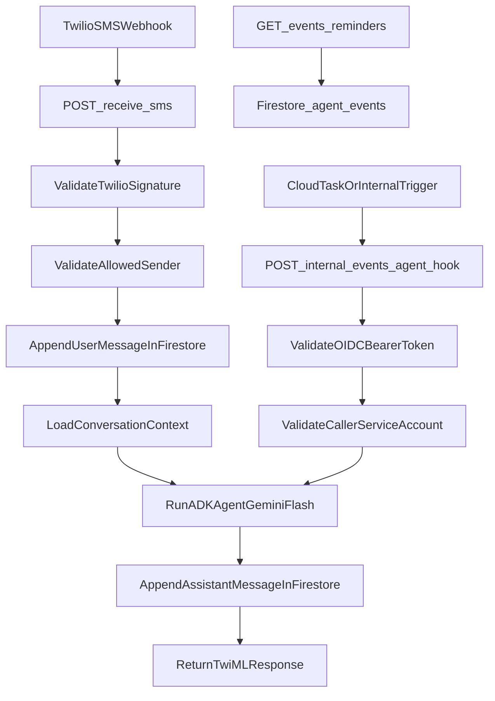

# Athena Agent (Cloud Run + Firestore + Twilio + ADK)

Production Flask service for an SMS-first assistant:
- Hosted on Cloud Run (`athena-api`)
- Uses Firestore for conversation/event persistence
- Schedules reminder delivery with Cloud Tasks
- Handles inbound SMS from Twilio at `/receive-sms`
- Runs Google ADK agent with Gemini on Vertex AI (`google-adk==1.26.0`)
- Exposes a reminders viewer at `/events/reminders`


## Current Production

- Project: `your-gcp-project-id`
- Region: `us-central1`
- Cloud Run URL: `https://your-service-xxxxx-uc.a.run.app`
- Cloud Run service: `athena-api`
- Artifact repo: `athena`

## Architecture



## Code Map

- `app.py`: Flask routes, Twilio validation, hook auth checks, response shaping
- `agent_runtime.py`: ADK agent setup, tools, role-seeded session history
- `conversation_store.py`: Firestore persistence for conversations/events/reminders
- `templates/index.html`: root page + quick test buttons

## API Endpoints

- `GET /health`
- `GET /`
- `POST /receive-sms` (Twilio inbound)
- `GET /events/reminders`
- `POST /internal/events/agent-hook` (OIDC-protected trigger for reminders)
- `POST /send-sms` (OIDC-protected internal outbound sender)

## Local Development (Python 3.11 required)

`google-adk==1.26.0` requires modern Python. Use 3.11+.

```bash
# one-time if missing
brew install python@3.11

cp example.env .env
/opt/homebrew/bin/python3.11 -m venv .venv
source .venv/bin/activate
pip install -r requirements.txt
gcloud auth application-default login
set -a && source .env && set +a
python app.py
```

Local auth uses Application Default Credentials. For Vertex-backed Gemini, set:

```bash
export GOOGLE_CLOUD_PROJECT="your-gcp-project-id"
export GOOGLE_CLOUD_LOCATION="us-central1"
export GOOGLE_GENAI_USE_VERTEXAI=true
```

### Local smoke checks

```bash
curl http://localhost:8080/health
curl http://localhost:8080/
curl http://localhost:8080/events/reminders
```

### Tests

```bash
source .venv/bin/activate
pytest -q
```

## Deploy

GitHub Actions deploy automation and repo secrets/vars were removed for this public portfolio copy.
If you redeploy yourself, build/push an image and update Cloud Run with `gcloud` (see `docs/INFRA.md`),
and keep Twilio/GCP credentials in local `.env` or your own secret store — not in this repo.

No Gemini API key is required in production. Cloud Run uses its runtime service account
with Vertex AI via Application Default Credentials.

### Runtime IAM (required)

- Cloud Run runtime service account must have `roles/datastore.user`
- Cloud Run runtime service account must have `roles/aiplatform.user`

## Firestore Indexes (important)

`GET /events/reminders` uses:
- `where(type == "reminder")`
- `order_by(created_at desc)`

This requires a composite index on `agent_events`.

Check indexes:
```bash
gcloud firestore indexes composite list \
  --project your-gcp-project-id \
  --format="table(name,collectionGroup,queryScope,state,fields)"
```

Create the required index:
```bash
gcloud firestore indexes composite create \
  --project your-gcp-project-id \
  --collection-group=agent_events \
  --query-scope=COLLECTION \
  --field-config field-path=type,order=ascending \
  --field-config field-path=created_at,order=descending
```

## Cloud Tasks Queue

Reminder creation expects a queue to exist.

Create queue (one-time):
```bash
gcloud tasks queues create athena-reminders \
  --location us-central1 \
  --project your-gcp-project-id
```

Check queue:
```bash
gcloud tasks queues describe athena-reminders \
  --location us-central1 \
  --project your-gcp-project-id
```

## Ops Debug Runbook

Check Cloud Run URL + ready revision:
```bash
gcloud run services describe athena-api \
  --region us-central1 \
  --format='value(status.url,status.latestReadyRevisionName)'
```

Tail recent Cloud Run errors:
```bash
gcloud logging read \
  "resource.type=cloud_run_revision AND resource.labels.service_name=athena-api AND severity>=ERROR" \
  --project your-gcp-project-id \
  --limit 20 \
  --format json
```

Prod endpoint checks:
```bash
curl -i -sS "https://your-service-xxxxx-uc.a.run.app/health"
curl -i -sS "https://your-service-xxxxx-uc.a.run.app/events/reminders"
```

## Security Notes

- `/receive-sms` validates Twilio signature and checks sender allowlist.
- `/internal/events/agent-hook` validates Google OIDC bearer token claims:
  - issuer is Google
  - email is verified
  - caller service account matches `TASKS_CALLER_SERVICE_ACCOUNT`
- Do not commit real secrets to repo; rotate credentials if exposed.
